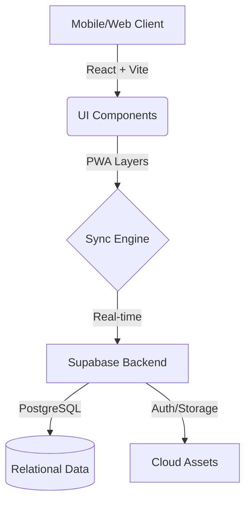

# 🏗️ CDX Warehouse & Construction Management System

<div align="center">
  
  <p align="center">
  <strong>A modern, professional, and mobile-optimized PWA for managing construction logistics, finance, and HR.</strong>
  </p>

  <p align="center">
    <a href="https://react.dev/"></a>
    <a href="https://www.typescriptlang.org/"></a>
    <a href="https://supabase.com/"></a>
    <a href="https://vitejs.dev/"></a>
    <a href="https://tailwindcss.com/"></a>
    <a href="https://web.dev/progressive-web-apps/"></a>
  </p>
</div>

---

## ✨ System Philosophy

**CDX Warehouse** is engineered to bring digital transformation to the construction frontlines. By abstracting complex logistics into an intuitive interface, we enable teams to focus on building while our system handles the data integrity.

### 🛡️ Privacy & Security
- **No Data Leakage**: Our public documentation is strictly technical. We do not expose internal UI layouts or sensitive employee data.
- **Robust Permissions**: Granular data access control based on user roles and specific warehouse assignments.
- **Real-time Integrity**: Every transaction is auditable and synchronized via Supabase's secure real-time engine.

---

## 🛠️ Architecture Overview

The system follows a modern decoupled architecture, combining the speed of Vite with the power of Supabase.



---

## 🚀 Core Modules

### 📦 Logic-Driven Inventory
- **Smart Stocking**: Automated tracking of multi-warehouse movements.
- **Verification Flow**: Multi-stage approval guards to prevent inventory discrepancies.

### 💰 Financial Intelligence
- **Deep Analytics**: Dynamic cost filtering and categorization.
- **Auditable Records**: Full history of project expenditures with role-based visibility.

### 🏭 Industrial Production
- **BOM Logic**: Complex material consumption modeling for manufacturing.
- **Flow Automation**: Coupled transactions that link raw material export to finished product import.

### 👥 HR & Intelligent Workforce
- **Time-Tracking**: Integrated Lunar-calendar attendance tracking.
- **Payroll Automation**: Dynamic engine for salary, advances, and allowances.

---

## 🛠️ Technology Stack

- **Core**: [React 18](https://reactjs.org/) + [TypeScript](https://www.typescriptlang.org/)
- **State Management**: React Hooks & [Supabase Realtime](https://supabase.com/)
- **UI/UX**: [Tailwind CSS](https://tailwindcss.com/) & [Lucide Icons](https://lucide.dev/)
- **Build Infrastructure**: [Vite](https://vitejs.dev/)

---

## 🔧 Installation & Setup

Follow these steps to get your local development environment up and running.

### 1. Clone & Enter Project
```bash
git clone https://github.com/tommm1207/CDX-Team.git
cd CDX-Team
```

### 2. Dependency Management
Recommended to use **npm** for consistency with the project's `package-lock.json`.
```bash
npm install
```

### 3. Database & Environment Configuration
1. **Supabase Setup**: Ensure your Supabase project is active and follows the required schema (Tables: `inventory`, `costs`, `employees`, `attendance`, etc.).
2. **Environment Variables**: Create a `.env` file in the root directory by copying the example:
```bash
cp .env.example .env
```
3. **Configure Keys**: Open `.env` and fill in your Supabase credentials:
```env
VITE_SUPABASE_URL=https://your-project.supabase.co
VITE_SUPABASE_ANON_KEY=your-anon-key-here
```

### 4. Development & Production
- **Start Dev Server**: Launch the app with hot-reloading at `http://localhost:5173`.
  ```bash
  npm run dev
  ```
- **Build for Production**: Generate an optimized build in the `dist/` folder.
  ```bash
  npm run build
  ```

---

<div align="center">
  <p>Crafted with ❤️ by <b>CDX TEAM - NGUYỄN KHÔI NGUYÊN (TOM)</b></p>
  <p><i>"Cộng tác để vươn xa" - Innovating Construction Management.</i></p>
</div>
