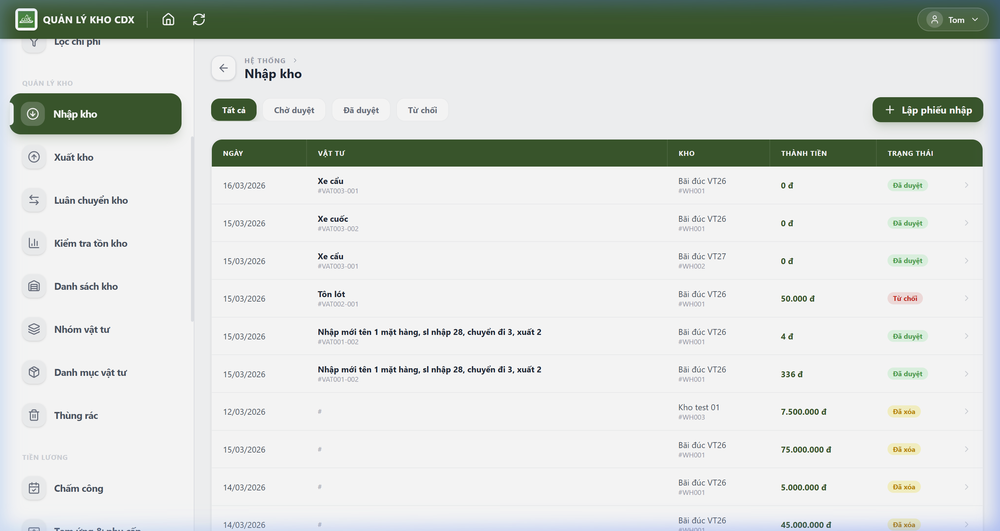
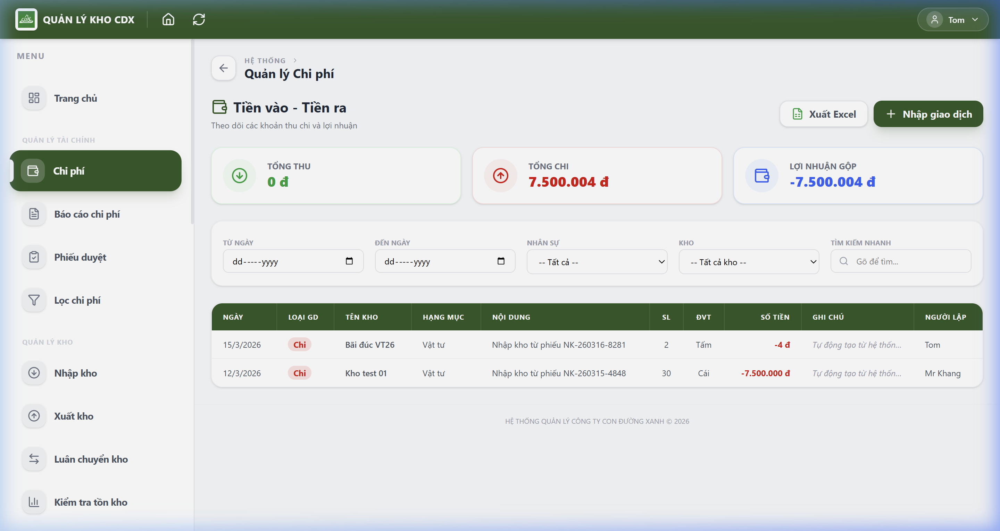
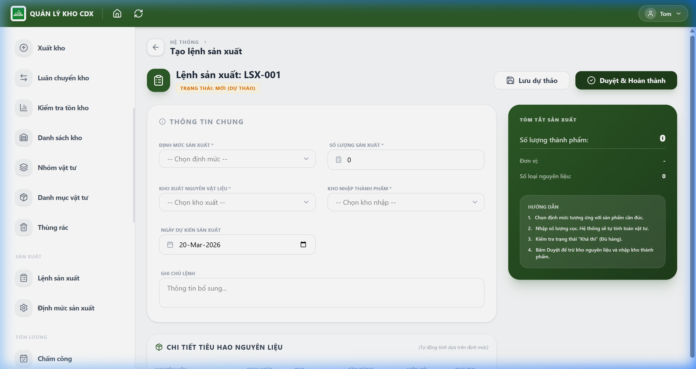
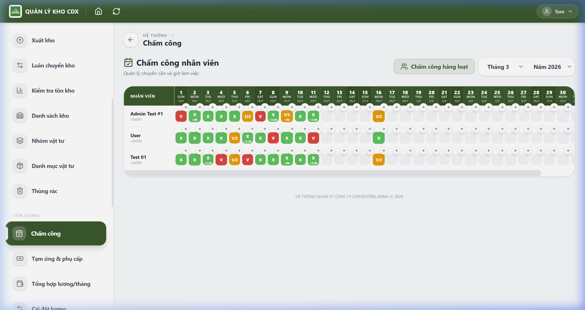

# 🏗️ CDX Warehouse & Construction Management System

<div align="center">
  
  <p align="center">
    <strong>A modern, professional, and mobile-optimized PWA for managing construction logistics, finance, and human resources.</strong>
  </p>

  <p align="center">
    <a href="https://react.dev/"></a>
    <a href="https://www.typescriptlang.org/"></a>
    <a href="https://supabase.com/"></a>
    <a href="https://vitejs.dev/"></a>
    <a href="https://tailwindcss.com/"></a>
    <a href="https://web.dev/progressive-web-apps/"></a>
  </p>
</div>

---

## ✨ Overview

**CDX Warehouse** is an all-in-one management platform designed specifically for the construction industry. It streamlines the complex workflows of material tracking, financial reporting, and payroll management into a single, cohesive experience. 

Built with **Vite + React + Tailwind CSS** and powered by **Supabase**, it offers real-time data synchronization and a seamless mobile experience through its Progressive Web App (PWA) capabilities.

---

## 🚀 Key Modules

### 📦 Smart Inventory Control
- **Dynamic Stock Management**: Real-time tracking of imports, exports, and internal transfers between warehouses.
- **Approval Workflow**: A rigorous 2-step verification process ensuring data integrity and accountability.
- **Interactive Reports**: Visual inventory checks with instant balance updates.
- 

### 💰 Financial Transparency
- **Expense Tracking**: Granular categorization of project costs by group, location, and personnel.
- **Real-time Analytics**: Automated cost reports and budget filtering for precise financial oversight.
- 

### 🏭 Production Efficiency
- **BOM (Bill of Materials)**: Define consumption logic for manufacturing finished goods (e.g., concrete piles).
- **Automated Transactions**: Streamlined production orders that automatically trigger raw material deductions and finished product stock-ins.
- 

### 👥 HR & Intelligent Payroll
- **Smart Attendance**: One-tap daily check-ins with Lunar calendar integration.
- **Dynamic Payroll**: Automated monthly salary calculations considering advances, allowances, and overtime.
- 

---

## 🛠️ Technical Stack

- **Frontend**: [React 18](https://reactjs.org/) with [TypeScript](https://www.typescriptlang.org/) for robust, type-safe development.
- **Styling**: [Tailwind CSS](https://tailwindcss.com/) with a custom design system for a premium look and feel.
- **Icons**: [Lucide React](https://lucide.dev/) for a consistent and professional iconography.
- **State & Backend**: [Supabase](https://supabase.com/) for real-time PostgreSQL database and simplified authentication.
- **Build Tool**: [Vite](https://vitejs.dev/) for ultra-fast development and optimized production builds.

---

## 🔧 Getting Started

### Prerequisites
- Node.js (v18+)
- npm or pnpm
- A Supabase project

### Installation

1. **Clone the repository:**
   ```bash
   git clone https://github.com/tommm1207/CDX-Team.git
   cd CDX-Team
   ```

2. **Install dependencies:**
   ```bash
   npm install
   ```

3. **Environment Setup:**
   Create a `.env` file in the root directory:
   ```env
   VITE_SUPABASE_URL=your_supabase_url
   VITE_SUPABASE_ANON_KEY=your_supabase_anon_key
   ```

4. **Run development server:**
   ```bash
   npm run dev
   ```

---

## 📱 Mobile Experience (PWA)
The app is fully responsive and can be installed on iOS and Android devices as a standalone app, providing a native-like experience with offline capabilities and push-like notifications.

---

<div align="center">
  <p>Crafted with ❤️ by <b>CDX TEAM - NGUYỄN KHÔI NGUYÊN (TOM)</b></p>
  <p><i>Building the future of construction management.</i></p>
</div>
